# Trail versioning plan

*Source: Cursor plan `trail_versioning_system_f2a200aa`*

## Checklist

- [ ] Add migrations: `trail_change_sets`, `trail_revisions`, `trail_revision_comments`; `trails.updated_at` / `updated_by_user_id`
- [ ] Wrap POST/PATCH/DELETE trail handlers in transactions; insert revision rows; accept `changeSetId` + `summary`
- [ ] Add activity feed + per-trail revision list/detail + rollback endpoint
- [ ] LeftDrawer recent edits + link to history route; map-bounds vs all filter
- [ ] Trail history page: version list, single-asset map preview, restore action
- [ ] Optional publish comment on save; discussion API + versioning tab thread

---

# Trail versioning and history UI (trail_ovelay)

## Current baseline

- **Data**: [`migrations/001_create_trails.sql`](../migrations/001_create_trails.sql) + user link in [`002_create_users.sql`](../migrations/002_create_users.sql). The live row in `trails` is the only history you have.
- **Writes**: [`POST /api/trails`](../app/api/trails/route.ts) creates rows with `uploaded_by_user_id`. [`PATCH /api/trails/[id]`](../app/api/trails/[id]/route.ts) checks auth but does **not** record `updated_by` / `updated_at` or any prior state.
- **UI**: Single-page map in [`app/ClientPage.tsx`](../app/ClientPage.tsx) with [`LeftDrawer`](../components/LeftDrawer.tsx). Trail edits use `handleSaveEditedTrail` (PATCH only). New trails use a “publish” checkbox in trim/draw flows; **edited trails do not**—you will want one consistent “commit” UX for optional comments.

## Recommended data model (trails first, extensible later)

**1. `trail_change_sets`** (optional grouping, OSM-changeset-lite)

- `id`, `created_by_user_id`, `created_at`, `comment` (nullable text, the “why I did this” message for the whole batch).

**2. `trail_revisions`** (append-only audit + rollback source)

- `id`, `trail_id`, `created_at`, `created_by_user_id`, `change_set_id` (nullable FK), `summary` (nullable; per-trail line when you still want a note inside a batch), `action` (`create` | `update` | `delete` | `rollback`), `payload` (JSONB: full trail snapshot at commit time—name, difficulty, direction, polyline, distances, notes, osm_way_id, etc.).
- Optional: `parent_revision_id` for explicit lineage (helps UI “rolled back from v12”).
- **Rollback**: never delete rows; apply old `payload` back onto `trails` and **insert a new** `trail_revisions` row (`action=rollback`, new snapshot matching restored state). Same as “forward” history.

**3. `trail_revision_comments`** (discussion)

- `id`, `trail_id`, `revision_id` (nullable: null = general thread for the trail; set = comment tied to a specific version), `author_user_id`, `body`, `created_at`.
- Nullable `revision_id` keeps one “Versioning” tab per trail without forcing every reply to pick a version; tying to `revision_id` when replying gives context.

**4. Small updates to `trails`**

- Add `updated_at`, `updated_by_user_id` (denormalized convenience for feeds and debugging). Keep `trail_revisions` as the full audit trail.

**Indexing**

- `(trail_id, created_at DESC)` for version list.
- `(created_at DESC)` for global activity feed.
- For “in map bounds” later: either filter in the app using existing [`polylineInBounds`](../components/LeftDrawer.tsx) on `payload.polyline`, or add a generated `centroid` / PostGIS when you outgrow client-side filtering.

## Write-path integration (must be transactional)

Inside the same DB transaction as `INSERT`/`UPDATE`/`DELETE` on `trails`:

1. Apply change to `trails`.
2. Insert `trail_revisions` with the **new** canonical snapshot (after update).
3. On create: first revision `action=create`; optionally create a change set if the client sent `changeSetId` + comment on first commit of a batch.

Extend API contracts:

- [`PATCH /api/trails/[id]`](../app/api/trails/[id]/route.ts): optional `changeSetId`, optional `summary` (and optionally inherit change-set-level comment only—product choice).
- [`POST /api/trails`](../app/api/trails/route.ts): same optional fields per request or shared `changeSetId` across the loop for true batch grouping.
- New `POST /api/trails/[id]/rollback` with `{ revisionId }` (or “restore this version”) performing the transactional restore + revision row.

**Deletes**: Prefer **tombstone** in history (`action=delete` + snapshot of last state) and either soft-delete on `trails` or hard-delete with revision retained—hard-delete + revision snapshot still allows “undelete” if you add it later.

## UI phases

```mermaid
flowchart LR
  subgraph phase1 [Phase 1]
    DB[Schema and migrations]
    API[Revision-aware writes]
  end
  subgraph phase2 [Phase 2]
    FeedAPI[Activity feed API]
    VerAPI[Versions by trail API]
  end
  subgraph phase3 [Phase 3]
    Side[History sidebar panel]
    Nav[Route to trail history]
  end
  subgraph phase4 [Phase 4]
    HistPage[Trail history page]
    MapIso[Map shows single asset]
    Roll[Rollback action]
  end
  subgraph phase5 [Phase 5]
    PubComment[Publish comment UX]
    Discuss[Discussion thread]
  end
  phase1 --> phase2 --> phase3 --> phase4 --> phase5
```

| Phase | Deliverable |
| ----- | ----------- |
| **1** | Migrations; transactional revision writes on POST/PATCH/DELETE; types/mappers in [`lib/api/mappers.ts`](../lib/api/mappers.ts) / [`lib/types`](../lib/types.ts). |
| **2** | `GET /api/trails/activity?bounds=…&limit=…` (bounds optional); `GET /api/trails/[id]/revisions`; `GET /api/trails/[id]/revisions/[revId]` for detail. |
| **3** | New drawer section or collapsible “Recent edits” in [`LeftDrawer`](../components/LeftDrawer.tsx): filter toggle “Visible on map” vs “All” using `mapBounds` already passed into the drawer. Rows link to `/trails/[id]/history` (or query-param panel—prefer dedicated route for shareable URLs). |
| **4** | History page: list versions (newest first), select version to preview geometry from `payload.polyline`; pass a prop to [`LeafletMap`](../components/LeafletMap.tsx) to render **only** that trail/version overlay; “Restore this version” calls rollback API. |
| **5** | **Publish comment**: add optional textarea to edit-save and publish flows; send `summary` / `changeSetId` from [`ClientPage`](../app/ClientPage.tsx) handlers. **Discussion**: thread UI + `POST/GET` comments API with moderation hooks later if needed. |

## Pros and cons of bulk / batch edits (UI and system)

**Pros**

- **Single explanation**: One `change_set.comment` covers many geometry fixes (similar to OSM changesets), which matches how mappers actually work.
- **Less feed noise**: The activity sidebar can show one row per change set (“User X: fixed 12 trails after storm”) instead of 12 identical lines.
- **Atomic narrative**: Rollback/discussion can target “this import” or “this maintenance pass” as a unit if you add “revert entire change set” later.
- **Efficient API**: One client-generated `changeSetId` reused across parallel PATCHes reduces chatter and ties revisions together without extra server round-trips.

**Cons**

- **Blame granularity**: Reviewers may need per-trail `summary` anyway inside a batch; without it, diagnosing *which* trail in a batch caused a problem is harder.
- **Rollback semantics**: “Undo batch” is ambiguous if some trails were also edited later; you need clear rules (only revert if head revision is still in that set, or rollback creates new revisions trail-by-trail).
- **UI complexity**: Users must understand change set vs trail; easy to ship a confusing mental model if the sidebar mixes change-set rows and per-trail rows without clear grouping.
- **Concurrency**: Two editors overlapping the same change set ID (unlikely if UUID per client session) or editing the same trail mid-batch requires server validation (reject stale base revision or use optimistic locking).
- **Discussion placement**: Thread on the change set vs per trail splits conversation; you may need both long term.

**Pragmatic recommendation**: Implement **revisions per trail** as the source of truth; add **optional `change_set_id`** for grouping and one **optional global comment** on the set. Sidebar default: **one row per trail revision**, grouped visually when `change_set_id` repeats; optional filter “collapse batches”.

## Out of scope for v1 (can document as later)

- Full OSM-style conflicts, redaction, or wiki pages.
- PostGIS-powered bbox queries at DB layer.
- Versioning for networks/photos—use the same pattern (`entity_type` + `entity_id`) when you are ready.

## Risk notes

- **Storage**: Full JSONB per revision scales roughly with edit frequency × trail size; acceptable for a long time; archive cold revisions if needed.
- **Extension sync**: If the Chrome extension writes trails, it must send the same optional fields and tolerate new APIs.
